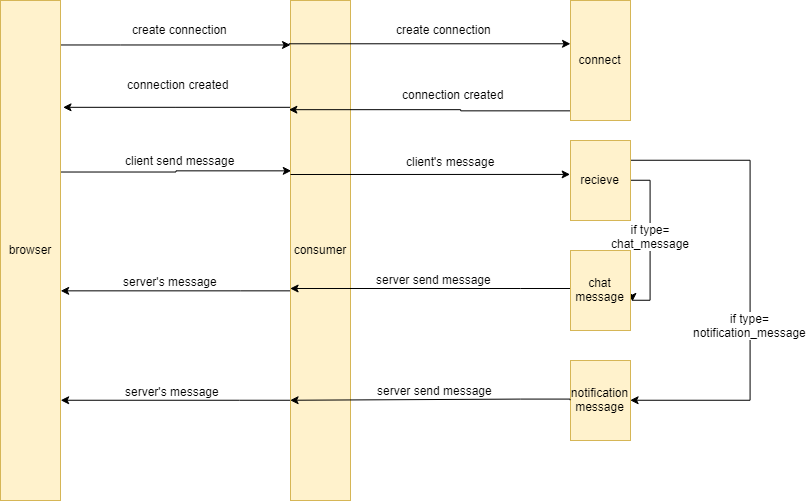

# websocket 連線架構
1. 前端發出連線需求  
2. 後端由 `routing.py` 內定義的url判斷進入哪個 `consumer.py ` 
3. 由 `consumer.py` 的 `connect()` 進行連線初始化，執行結束後，連線成功  
4. 前後連線成功後，前端會看到 `101 switching protocol` ，後端看到 `WSCONNECT /ws/chat/chat/`  
5. 前端傳送訊息給後端，由後端的 `connsumer.py` 中 `receive()` 處理訊息
6. `receive()` 可以用channel_layer與其他的consumer聯絡，其中 `type` 是定義呼叫其他consumer的function名字  
7. consumer藉由 `send()` 來送訊息到前端
8. 當任何一方段開連線後，後端會呼叫 `dissconnect()` 來清除連線狀態  

以下是websocket連線架構圖

# Consumer.py程式解釋

## channel_layer解釋
由於每個websocket之間不互通，因此藉由layer來連結，可以將各個websocket加入group。之後就可以送訊息到指定的websocket或是group。

## connect
此為websocket連結時執行的程式，會將登入的使用者與此websocket連結，方便之後可以送給特定使用者。
```python
await self.add_clients()
```    

之後會將此websocket加入一個名子是username的group，之後可以直接用username送訊息。
```python
await self.channel_layer.group_add(
    self.user_name,
    self.channel_name,
)
```
    

## disconnect
此為websocket在關閉時做的動作，將此websocket從layer中移除
```python
await self.channel_layer.group_discard(
    self.user_name,
    self.channel_name,
)    
```
    
並且將此websocket與user的連結移除
```python
await self.delete_client()
```

## receive
當此websocket收到前端的訊息要做的事情，主要分成notification與message兩種
* #### message
此時的`cate`是`chat`，我們會將訊息送到聊天室所有的user的websocket

    total_channel = await self.get_all_user_layer(group_name=groupname)
        for channel in total_channel:
            await self.channel_layer.send(
                channel,
                {
                    'type': 'chat_message',
                    'message': message,
                    'cate': cate,
                    'group_name': groupname,
                    'from_user': self.user
                }
            )

並且將message存進資料庫

    await self.put_message(
        group_id=groupname,
        from_user=self.user,
        text=message,
    )

* ####notification
此時的`cate`是`notification`，會先將訊息存進資料庫

    notification = await self.put_notification(text=message,
                                               from_user=self.user.username,
                                               to_user=user_name)


並將訊息送到目標user的websocket
    
    await self.channel_layer.group_send(
        user_name,
        {
            'type': 'notification_message',
            'message': message,
            'cate': cate,
            'from_user': self.user,
            'id': notification.id
        }
    )

## chat_message
當收到來自layer且`'type': 'chat_message'`的訊息，會呼叫這個程式
收到聊天室訊息後，會送給前端訊息的內容

```python
await self.send(text_data=json.dumps({
    'type': 'chat',
    'group_name': event['group_name'],
    'display_name': group.display_name,
    'message': message,
    'from_user': event['from_user'].username,
    'date': now.__str__()
}))
```

##  notification_message
當收到來自layer且`'type': 'notification_message'`的訊息，會呼叫這個程式
收到通知後，會送給前端通知的內容

```python
await self.send(text_data=json.dumps({
    'type': 'notification',
    'message': message,
    'from_user': event['from_user'].username,
    'date': str(now),
    'id': event['id'].id,
}))
```

##  
[channel 參考資料](https://channels.readthedocs.io/en/latest/)
