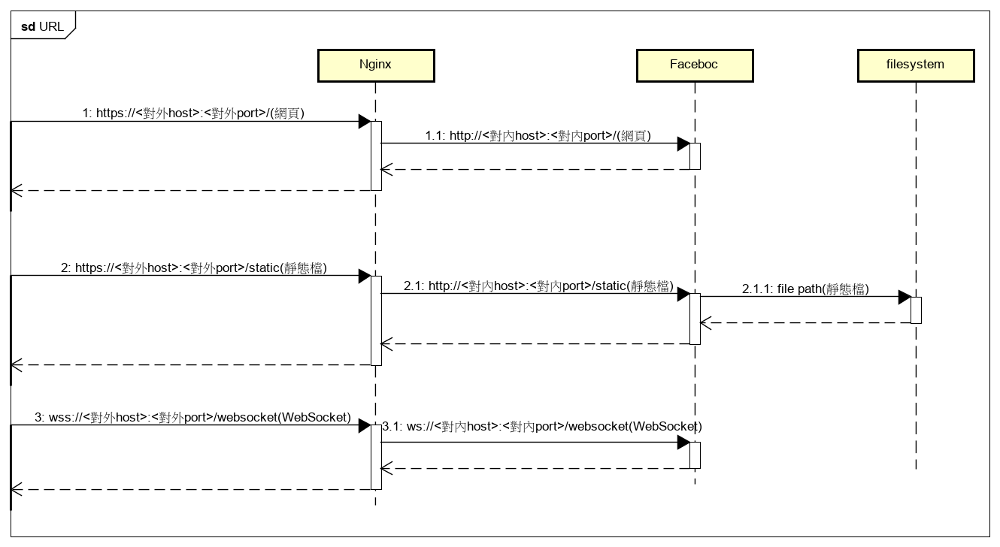

[回上一頁](../文件導覽.md)  

Faceboc採用Nginx作為static file與對外連結的伺服器  
而Django為了使用asgi 使用daphne執行server  

由於Nginx是對外伺服器  
因此它要負責對外的host與port(e.g. 140.116.82.67:20000)與處理HTTPS/WSS protocal的請求  
之後Nginx會將請求轉交到對內伺服器(i.e. 由daphne運行的Faceboc)  
對內伺服器要負責對內的host與port(e.g. 127.0.0.1:10000)與處理HTTP/WS protocal的請求  

因此整體的URL轉換架構如下圖  
  

圖中描述三大類型的轉換  

1. 一般情況的連接  
這裡包含瀏覽網頁的GET、使用Web API的POST/PUT/DELTE等連接方式  
首先外部會透過[https://<對外host>:<對外port>/<...>]()訪問Nginx  
Nginx處理完HTTPS的請求後會以HTTP的方式  
透過[http://<對內host>:<對內port>/<...>]()將請求轉達給Daphne

2. 靜態檔案的取得
在Deployment後，Django不再負責靜態檔案(e.g. js, css file)  
而是交由Nginx負責靜態檔案
首先外部會透過[https://<對外host>:<對外port>/static/<...>]()訪問Nginx  
Nginx處理完HTTPS的請求後會找相對應路徑(e.g. C:/Faceboc/staticfiles/<...>)的靜態檔

3. Websocket連接
首先外部會透過[wss://<對外host>:<對外port>/websocket/<...>]()訪問Nginx  
Nginx處理完WSS的請求後會以WS的方式  
透過[ws://<對內host>:<對內port>/websocket/<...>]()將請求轉達給Daphne  
  
[回上一頁](../文件導覽.md)  