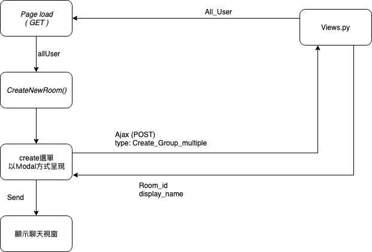
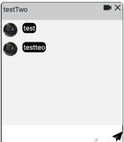

#建立群組聊天 （開發）

建立群組聊天的程式運作邏輯  

###Step  
1. 建立群組聊天的可選名單（allUser）會在Get時由Views.py傳到前端  
2. 當點下新增按鈕會呼叫CreateNewRoom()  
3. 在modal中選擇完成員和輸入房間名稱後按下Send  
4. 由Ajax送至Views.py創立房間並回傳id 和 displayName
5. Success!

需更改部分：  

在多人聊天時使用大頭貼作為辨識用戶的方式  
因此需要拿到model中存取大頭貼的資訊  
* 需作的更改：
   1. Step1中在前端紀錄User的allUser要多紀錄頭貼資訊  
   2. 在所有class = chatRoomAvatar的img Tag 裡 src改成對應的位置  
   
   
    
    

  
  

